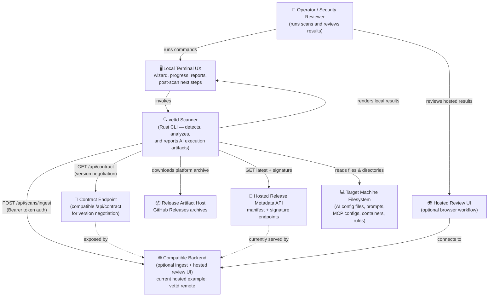

# C4 Level 1 — System Context

Shows how the **vettd** scanner relates to external actors and systems.

## Key Relationships

| From  | To                  | Protocol           | Purpose                                           |
| ----- | ------------------- | ------------------ | ------------------------------------------------- |
| User  | Local Terminal UX   | CLI (stdin/stdout) | Run scans, inspect local results, choose next steps |
| vettd | Filesystem          | OS read            | Discover and analyze AI artifacts                 |
| vettd | Compatible Backend  | HTTPS POST         | Submit scan contract payloads                     |
| vettd | Contract Endpoint   | HTTPS GET          | Contract version negotiation                      |
| vettd | Release Metadata API | HTTPS GET         | Fetch signed update metadata                      |
| vettd | Release Artifact Host | HTTPS GET        | Download platform archives for self-update        |
| User  | Hosted Review UI    | Browser            | Review submitted results in a backend UI          |
