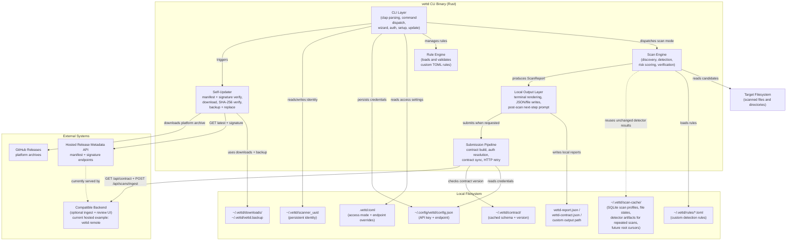

# C4 Level 2 — Container Diagram

Shows the major runtime containers and data stores within the **vettd** system boundary.

## Container Responsibilities

| Container           | Technology          | Purpose                                                                                       |
| ------------------- | ------------------- | --------------------------------------------------------------------------------------------- |
| CLI Layer           | clap + crossterm    | Parse commands, run wizard/setup/auth/update flows, apply access gating                       |
| Scan Engine         | walkdir + detectors | Discover filesystem candidates, run detectors, score risk, verify                             |
| Local Output Layer  | serde + ANSI output | Render terminal output, write JSON files, offer post-scan next steps                          |
| Submission Pipeline | ureq (HTTP)         | Build contract payloads, resolve auth, sync contract version, submit payload                  |
| Self-Updater        | ureq + flate2/tar   | Verify signed manifests, download platform archives, verify SHA-256, swap binary              |
| Rule Engine         | toml + validation   | Load, validate, install custom `.toml` detection rules                                        |
| Local Storage       | Filesystem          | Persist identity, auth, rules, access settings, contract cache, scan cache, update temp files |
