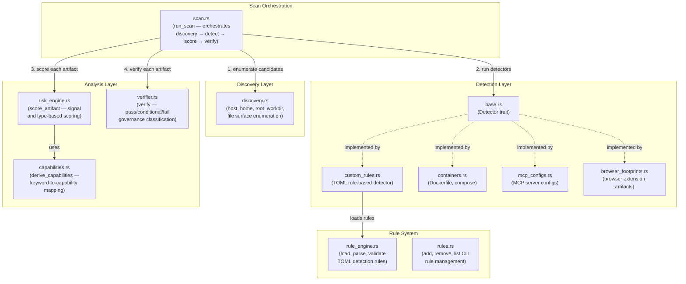
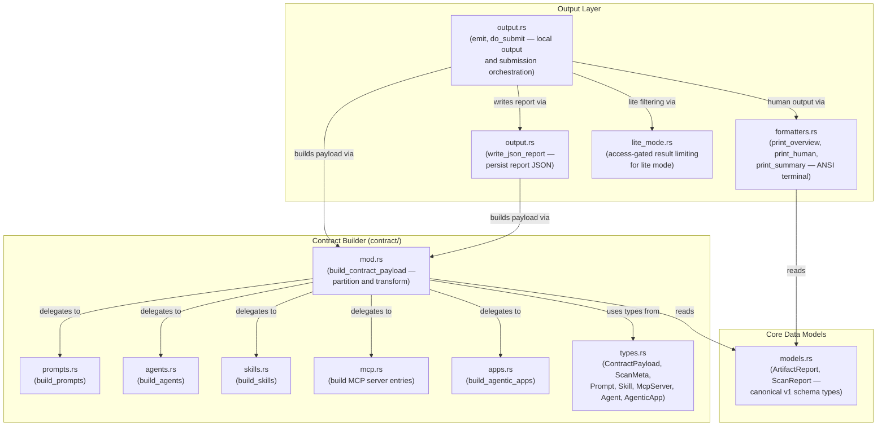
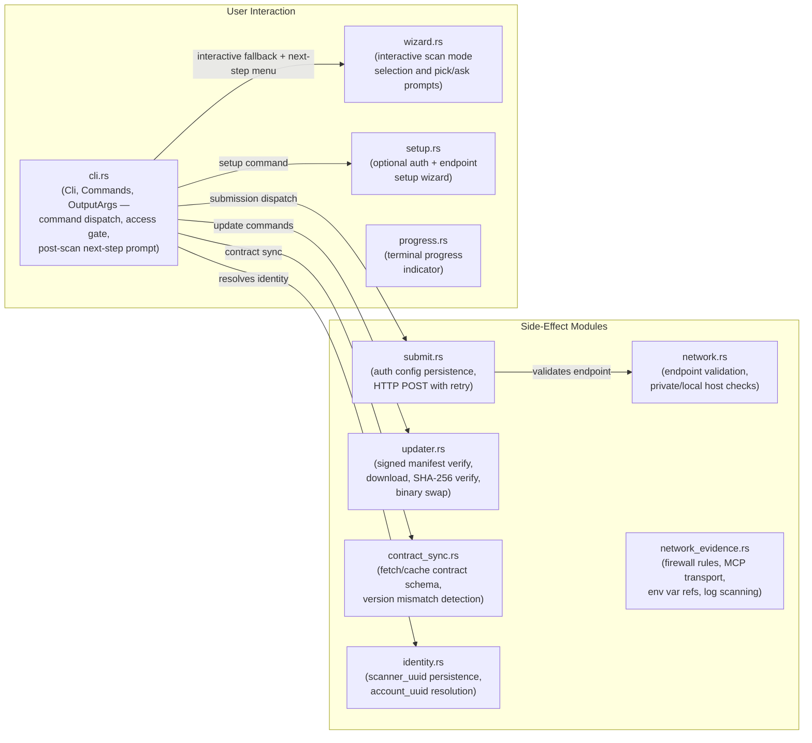

# C4 Level 3 — Component Diagram

Shows the internal Rust modules within the **vettd** crate and their relationships.

## Scan Engine Components

## Contract & Output Components

## Side-Effect & Infrastructure Components

## Module Index

| Module                            | Layer            | Responsibility                                  |
| --------------------------------- | ---------------- | ----------------------------------------------- |
| `cli.rs`                          | User Interaction | CLI argument parsing, command dispatch, access gating |
| `wizard.rs`                       | User Interaction | Interactive scan mode picker                    |
| `setup.rs`                        | User Interaction | Optional auth and endpoint setup                |
| `progress.rs`                     | User Interaction | Terminal progress indicator                     |
| `discovery.rs`                    | Discovery        | Filesystem candidate enumeration                |
| `detectors/base.rs`               | Detection        | `Detector` trait definition                     |
| `detectors/custom_rules.rs`       | Detection        | TOML rule-based artifact detection              |
| `detectors/containers.rs`         | Detection        | Docker/compose artifact detection               |
| `detectors/mcp_configs.rs`        | Detection        | MCP server config detection                     |
| `detectors/browser_footprints.rs` | Detection        | Browser extension artifact detection            |
| `rule_engine.rs`                  | Rules            | TOML rule loading and validation                |
| `rules.rs`                        | Rules            | CLI rule management (add/remove/list)           |
| `risk_engine.rs`                  | Analysis         | Signal/type-based risk scoring                  |
| `verifier.rs`                     | Analysis         | Governance verification (pass/conditional/fail) |
| `capabilities.rs`                 | Analysis         | Keyword-to-capability mapping                   |
| `models.rs`                       | Core             | `ArtifactReport`, `ScanReport` types            |
| `scan.rs`                         | Orchestration    | Scan pipeline coordinator                       |
| `contract/`                       | Contract         | Raw artifacts → v2 contract payload             |
| `output.rs`                       | Output           | Local output, JSON files, and submission orchestration |
| `formatters.rs`                   | Output           | ANSI terminal formatters                        |
| `lite_mode.rs`                    | Output           | Result limiting and local scoring               |
| `payload.rs`                      | Output           | Legacy v1 payload builder                       |
| `submit.rs`                       | Side-Effect      | Auth config persistence and HTTP submission     |
| `network.rs`                      | Side-Effect      | Endpoint validation                             |
| `network_evidence.rs`             | Side-Effect      | Host network evidence gathering                 |
| `updater.rs`                      | Side-Effect      | Signed self-update verification and swap        |
| `contract_sync.rs`                | Side-Effect      | Contract schema fetch/cache                     |
| `identity.rs`                     | Side-Effect      | Scanner UUID persistence                        |
