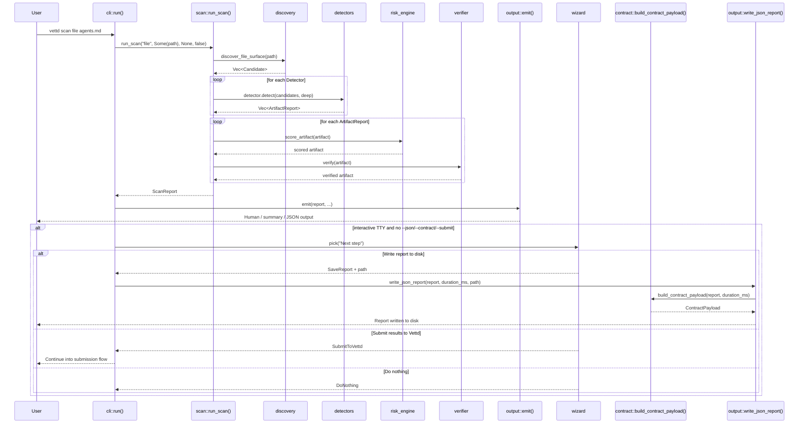
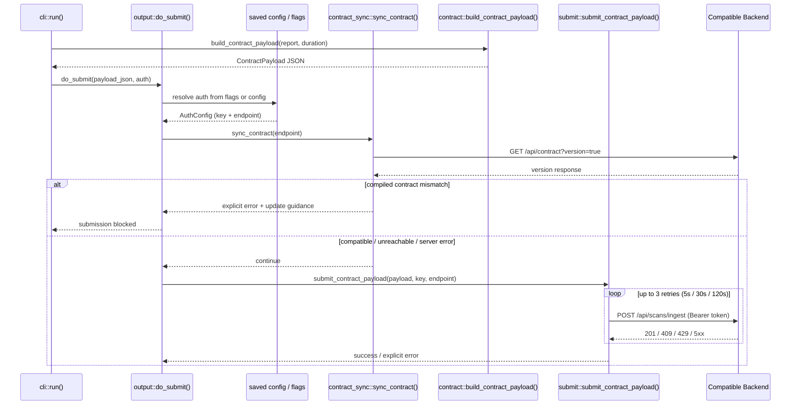
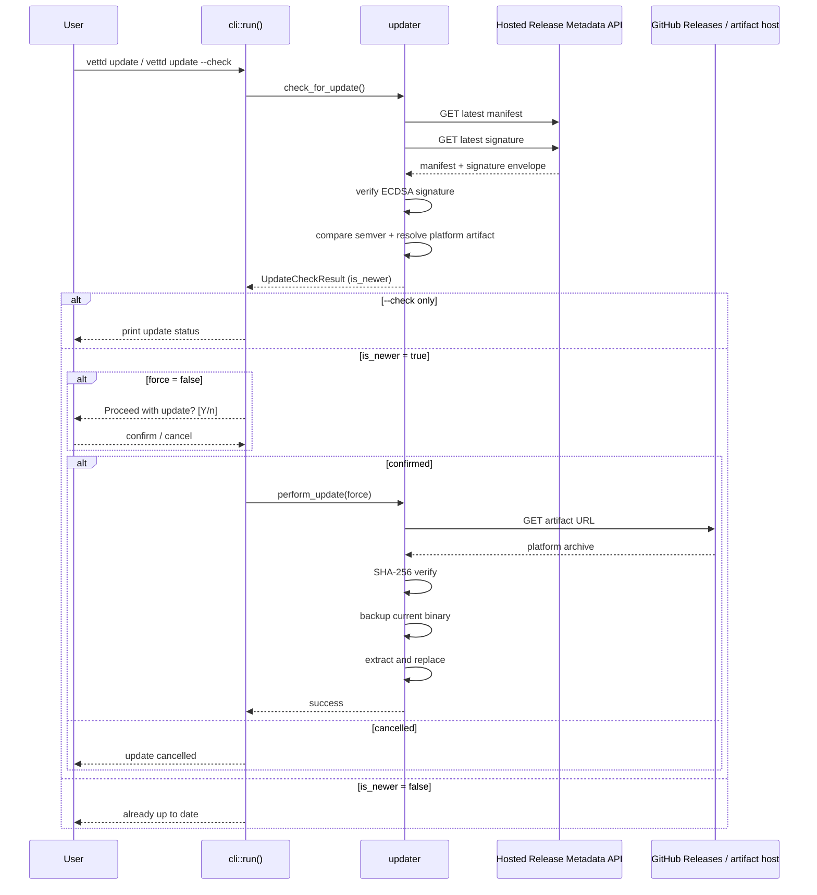
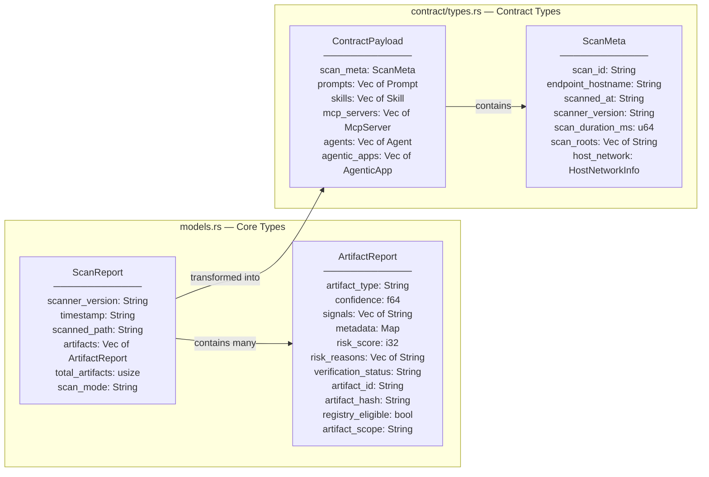
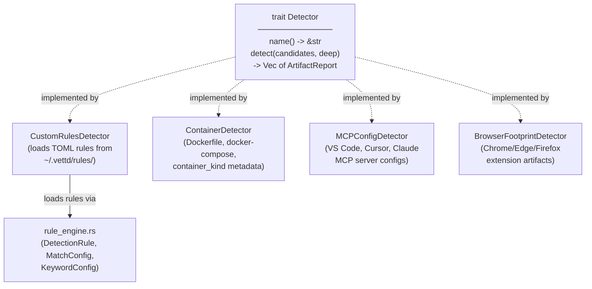
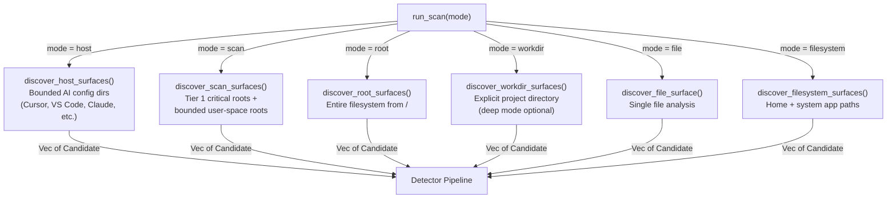

# C4 Level 4 — Code Diagrams

Zooms into key data flows and type relationships at the code level.

## Scan Pipeline Sequence

The core scan execution from CLI invocation through to output, including the
interactive post-scan next-step menu for local terminal runs.



## Access Gate & Output Branching

How access settings, output flags, and TTY detection shape the user-visible
result after a scan completes.

```mermaid
flowchart TD
    Report["ScanReport returned from scan.rs"]
    Access["cli.rs\nload_access_config()"]
    Gate{"Access mode"}
    Lite["lite_mode.rs\nlimit_lite_mode_report()"]
    Full["Keep full artifact set"]
    Severity["filter_by_severity()"]
    Flags{"Output / submit flags?"}
    Human["formatters.rs\nprint overview / full / summary"]
    Json["output.rs\nprint JSON to stdout"]
    Contract["cli.rs + contract/\nbuild contract payload"]
    Save["write_json_report() /\nwrite contract file"]
    Submit["resolve auth → contract sync →\nsubmit_contract_payload()"]
    Prompt{"TTY and no\n--json / --contract / --submit?"}
    Next["wizard::pick(\"Next step\")"]
    Done["Exit"]

    Report --> Access --> Gate
    Gate -->|"lite"| Lite --> Severity
    Gate -->|"licensed / default"| Full --> Severity
    Severity --> Flags
    Flags -->|"default / --full / --summary"| Human --> Prompt
    Flags -->|"--json"| Json --> Done
    Flags -->|"--out"| Human
    Human -->|"optional --out"| Save
    Flags -->|"--contract"| Contract
    Contract -->|"optional --out"| Save
    Contract -->|"--submit"| Submit --> Done
    Prompt -->|"yes"| Next
    Prompt -->|"no"| Done
    Next -->|"Write report to disk"| Save --> Done
    Next -->|"Submit results"| Submit
    Next -->|"Do nothing"| Done
```

## Submission Flow Sequence

The submission path when `--submit` is used or the interactive post-scan prompt
continues into submission.



## Self-Update Flow Sequence

Binary update check, confirmation, download, and replacement.



## Core Data Types



## Detector Trait and Implementations



## Discovery Modes


