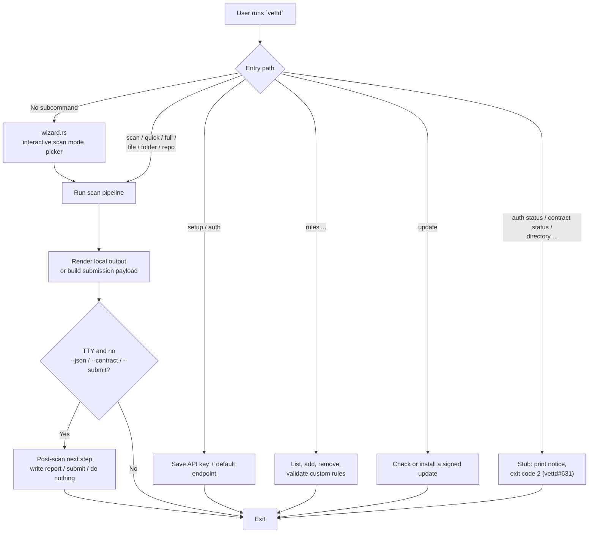
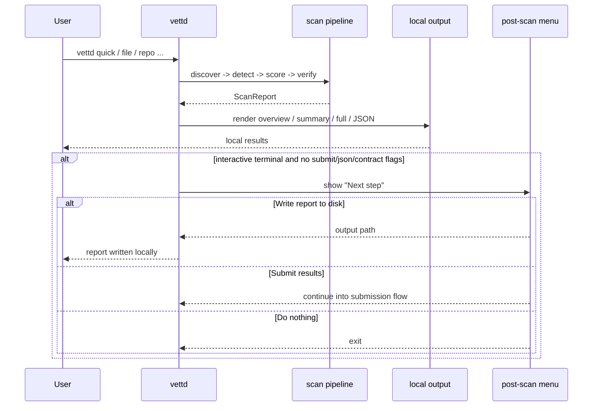
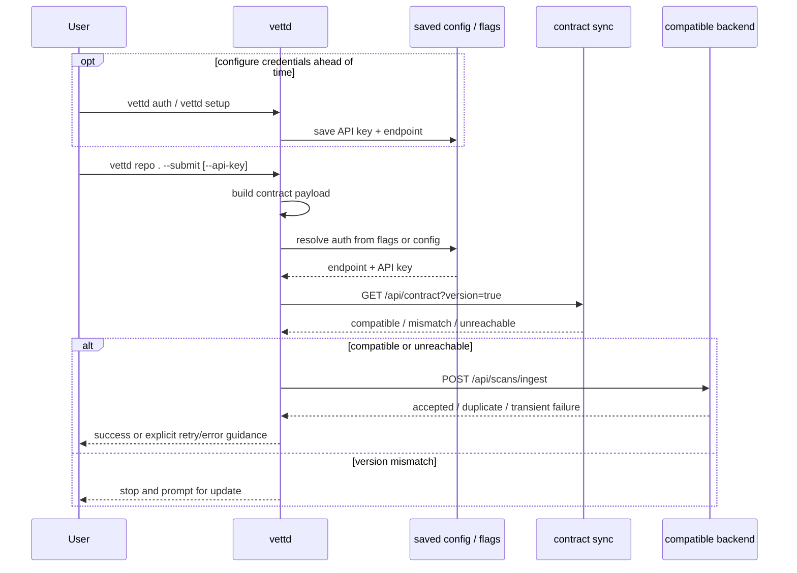
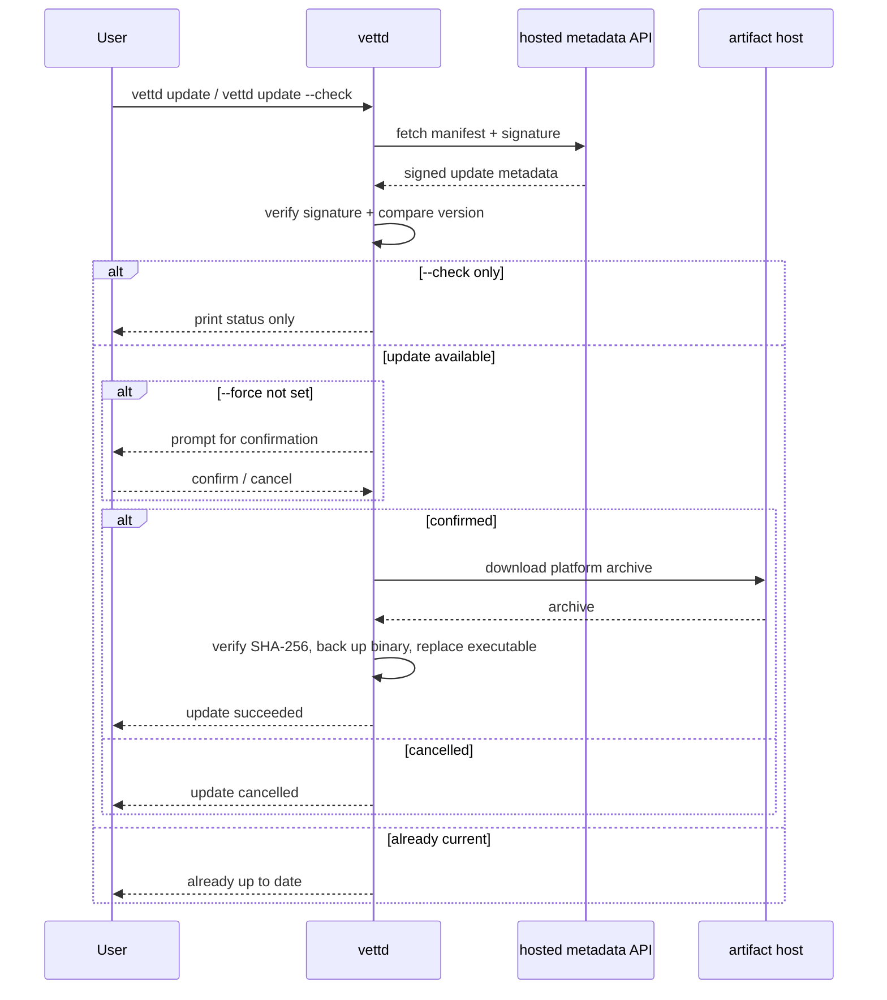

# User Flows

This document complements the C4 architecture diagrams with the main public
CLI journeys users actually experience.

## Command Entry Paths

The `auth status`, `contract status`, and `directory`
(`search`/`list`/`trending`/`random`/`view`/`findings`/`compare`) commands are
registered in the CLI but currently scaffolded as stubs: each prints a
not-yet-implemented notice to stderr and exits with code 2 until vettd#631
lands the backend logic.

## Local-First Scan Journey

## Scan and Submit Journey

## Update Journey

