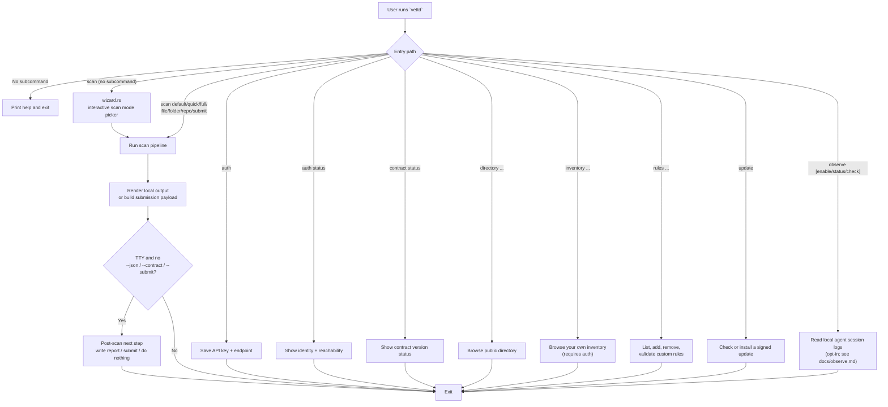
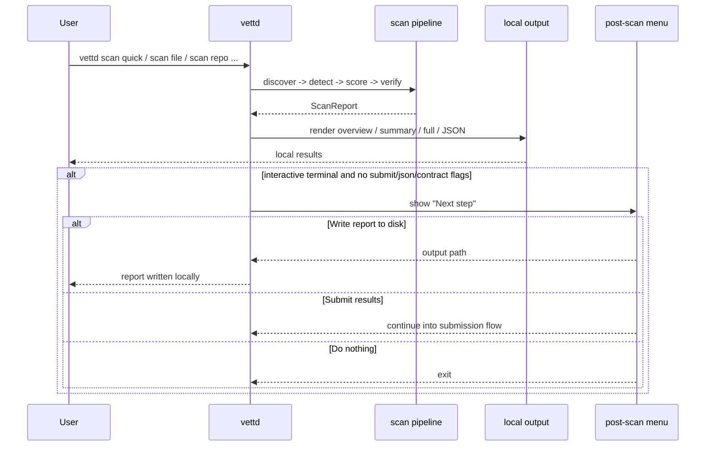
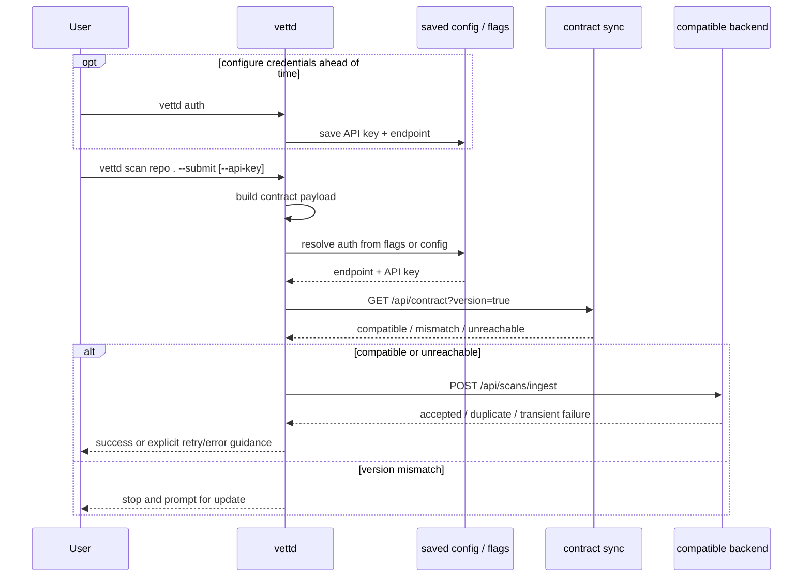
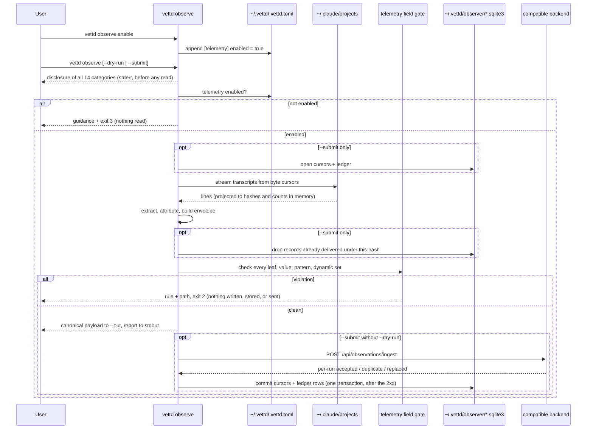
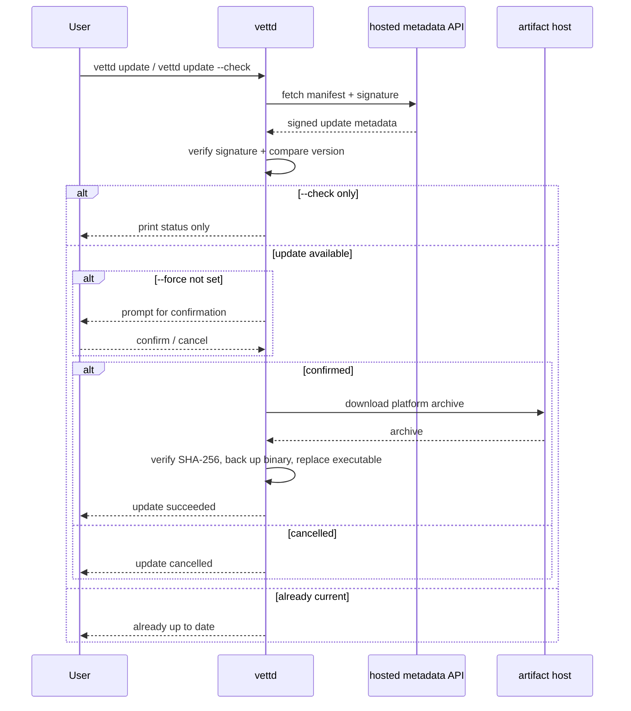

# User Flows

This document complements the C4 architecture diagrams with the main public
CLI journeys users actually experience.

## Command Entry Paths

```mermaid
flowchart TD
    Start["User runs `vettd`"] --> Choice{"Entry path"}
    Choice -->|"No subcommand"| Help["Print help and exit"]
    Choice -->|"scan (no subcommand)"| Wizard["wizard.rs\ninteractive scan mode picker"]
    Choice -->|"scan default/quick/full/\nfile/folder/repo/submit"| Scan["Run scan pipeline"]
    Choice -->|"auth"| Auth["Save API key + endpoint"]
    Choice -->|"auth status"| AuthStatus["Show identity + reachability"]
    Choice -->|"contract status"| ContractStatus["Show contract version status"]
    Choice -->|"directory ..."| Directory["Browse public directory"]
    Choice -->|"inventory ..."| Inventory["Browse your own inventory\n(requires auth)"]
    Choice -->|"rules ..."| Rules["List, add, remove,\nvalidate custom rules"]
    Choice -->|"update"| Update["Check or install a signed update"]
    Choice -->|"observe [enable/status/check]"| Observe["Read local agent session logs\n(opt-in; see docs/observe.md)"]

    Wizard --> Scan
    Scan --> Output["Render local output\nor build submission payload"]
    Output --> Next{"TTY and no\n--json / --contract / --submit?"}
    Next -->|"Yes"| Prompt["Post-scan next step\nwrite report / submit / do nothing"]
    Next -->|"No"| End["Exit"]
    Auth --> End
    AuthStatus --> End
    ContractStatus --> End
    Directory --> End
    Inventory --> End
    Rules --> End
    Update --> End
    Observe --> End
    Prompt --> End
```

The `auth status`, `contract status`, `directory`
(`search`/`list`/`random`/`view`/`findings`/`compare`), and `inventory`
(`search`/`list`/`view`/`findings`/`compare` — authenticated, no `random`)
commands are fully implemented and connected to the vettd backend.

## Local-First Scan Journey

```mermaid
sequenceDiagram
    participant User
    participant CLI as vettd
    participant Scan as scan pipeline
    participant Out as local output
    participant Prompt as post-scan menu

    User->>CLI: vettd scan quick / scan file / scan repo ...
    CLI->>Scan: discover -> detect -> score -> verify
    Scan-->>CLI: ScanReport
    CLI->>Out: render overview / summary / full / JSON
    Out-->>User: local results
    alt interactive terminal and no submit/json/contract flags
        CLI->>Prompt: show "Next step"
        alt Write report to disk
            Prompt-->>CLI: output path
            CLI-->>User: report written locally
        else Submit results
            Prompt-->>CLI: continue into submission flow
        else Do nothing
            Prompt-->>CLI: exit
        end
    end
```

## Scan and Submit Journey

```mermaid
sequenceDiagram
    participant User
    participant CLI as vettd
    participant Auth as saved config / flags
    participant Sync as contract sync
    participant Backend as compatible backend

    opt configure credentials ahead of time
        User->>CLI: vettd auth
        CLI->>Auth: save API key + endpoint
    end

    User->>CLI: vettd scan repo . --submit [--api-key]
    CLI->>CLI: build contract payload
    CLI->>Auth: resolve auth from flags or config
    Auth-->>CLI: endpoint + API key
    CLI->>Sync: GET /api/contract?version=true
    Sync-->>CLI: compatible / mismatch / unreachable
    alt compatible or unreachable
        CLI->>Backend: POST /api/scans/ingest
        Backend-->>CLI: accepted / duplicate / transient failure
        CLI-->>User: success or explicit retry/error guidance
    else version mismatch
        CLI-->>User: stop and prompt for update
    end
```

## Observe and Submit Journey

`vettd observe` is a separate journey from a scan: it reads agent session transcripts rather
than the filesystem, it is off until the user opts in, and its payload is gate-checked before
anything is written or sent. See [`observe.md`](observe.md) for the full model.

```mermaid
sequenceDiagram
    participant User
    participant CLI as vettd observe
    participant Config as ~/.vettd/.vettd.toml
    participant Logs as ~/.claude/projects
    participant Gate as telemetry field gate
    participant Store as ~/.vettd/observer/*.sqlite3
    participant Backend as compatible backend

    User->>CLI: vettd observe enable
    CLI->>Config: append [telemetry] enabled = true

    User->>CLI: vettd observe [--dry-run | --submit]
    CLI-->>User: disclosure of all 14 categories (stderr, before any read)
    CLI->>Config: telemetry enabled?
    alt not enabled
        CLI-->>User: guidance + exit 3 (nothing read)
    else enabled
        opt --submit only
            CLI->>Store: open cursors + ledger
        end
        CLI->>Logs: stream transcripts from byte cursors
        Logs-->>CLI: lines (projected to hashes and counts in memory)
        CLI->>CLI: extract, attribute, build envelope
        opt --submit only
            CLI->>Store: drop records already delivered under this hash
        end
        CLI->>Gate: check every leaf, value, pattern, dynamic set
        alt violation
            Gate-->>User: rule + path, exit 2 (nothing written, stored, or sent)
        else clean
            CLI-->>User: canonical payload to --out, report to stdout
            opt --submit without --dry-run
                CLI->>Backend: POST /api/observations/ingest
                Backend-->>CLI: per-run accepted / duplicate / replaced
                CLI->>Store: commit cursors + ledger rows (one transaction, after the 2xx)
            end
        end
    end
```

## Update Journey

```mermaid
sequenceDiagram
    participant User
    participant CLI as vettd
    participant Meta as hosted metadata API
    participant Host as artifact host

    User->>CLI: vettd update / vettd update --check
    CLI->>Meta: fetch manifest + signature
    Meta-->>CLI: signed update metadata
    CLI->>CLI: verify signature + compare version
    alt --check only
        CLI-->>User: print status only
    else update available
        alt --force not set
            CLI-->>User: prompt for confirmation
            User-->>CLI: confirm / cancel
        end
        alt confirmed
            CLI->>Host: download platform archive
            Host-->>CLI: archive
            CLI->>CLI: verify SHA-256, back up binary, replace executable
            CLI-->>User: update succeeded
        else cancelled
            CLI-->>User: update cancelled
        end
    else already current
        CLI-->>User: already up to date
    end
```
